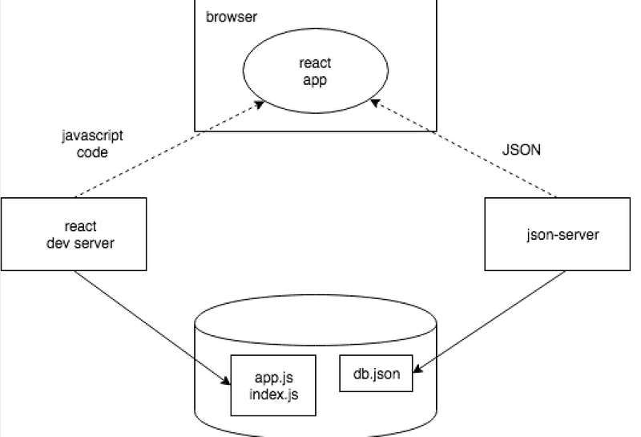

# setup


The JavaScript code making up our React application is run in the browser. The browser gets the JavaScript from the React dev server, which is the application that runs after running the command npm run dev. The dev-server transforms the JavaScript into a format understood by the browser. Among other things, it stitches together JavaScript from different files into one file.

The React application running in the browser fetches the JSON formatted data from json-server running on port 3001 on the machine. The server we query the data from - json-server - gets its data from the file db.json.

# json server

install `npm install -g json-server` or `npm install json-server --save-dev` for developer dependency

start `json-server --port 3001 --watch db.json` or `npx json-server --port 3001 --watch db.json`

- the `--watch` option automatically looks for any saved changes to `db.json`

you can include additional script for the json-server in package.json

```json
{
  // ...
  "scripts": {
    "dev": "vite",
    "build": "vite build",
    "lint": "eslint . --ext js,jsx --report-unused-disable-directives --max-warnings 0",
    "preview": "vite preview",

    "server": "json-server -p3001 --watch db.json"
  }
}
```

# React + Vite

This template provides a minimal setup to get React working in Vite with HMR and some ESLint rules.

Currently, two official plugins are available:

- [@vitejs/plugin-react](https://github.com/vitejs/vite-plugin-react/blob/main/packages/plugin-react/README.md) uses [Babel](https://babeljs.io/) for Fast Refresh
- [@vitejs/plugin-react-swc](https://github.com/vitejs/vite-plugin-react-swc) uses [SWC](https://swc.rs/) for Fast Refresh
